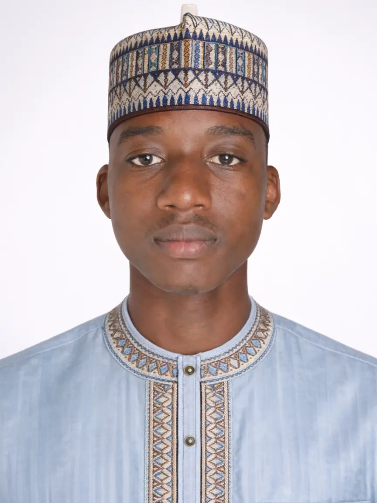

# Muhammad M. Usman

## 👨‍💻 Full-Stack Software Engineer

A passionate Full-Stack Software Engineer specializing in modern web and mobile development using **React, Next.js, Node.js, and Expo**.  
I build scalable, performant, and user-focused digital products with clean architecture and strong engineering principles.

---

## 🚀 About Me

I focus on building modern applications that solve real-world problems.  
My work combines **strong backend logic, responsive frontend systems, and clean UI/UX design**.

- 💻 Full-Stack Web Development
- 📱 Mobile App Development (React Native / Expo)
- ⚙️ API & System Architecture
- ☁️ Scalable Cloud-Based Applications

---

## 🧠 Technical Focus

- Frontend: React, Next.js, TypeScript, Tailwind CSS  
- Backend: Node.js, REST APIs, Firebase  
- Mobile: React Native, Expo  
- Tools: Git, Vercel, Firebase, Docker (basic)

---

## 🧩 Featured Work

- 🛒 E-commerce platforms with scalable architecture  
- 📊 Financial tracking and dashboard systems  
- 📱 Cross-platform mobile applications  
- ⚡ Performance-optimized web applications  

---

## 🎓 Education

- 🎓 B.Sc (Ed) Computer Science Education — *FCE (T) Bichi (Ongoing)*  
- 🎓 NCE Biology / Computer Science — *FCE (T) Bichi*  
- 🎓 Web Development Bootcamp — *London App Brewery*  
- 🎓 Mobile Development Certification — *Codedamn (React Native / Expo)*  

---

## 🧭 Professional Experience

### Full-Stack Software Engineer (Freelance)
- Building production-ready web and mobile applications
- Designing scalable system architectures
- Delivering client-focused solutions

### Senior Developer — BichiNet
- Led software development initiatives
- Improved internal systems and infrastructure
- Optimized performance of network-based services

---

## 🌐 Portfolio

👉 https://mmusmanlab.vercel.app

---

## 📬 Contact

- Email: your-email@example.com  
- Location: Nigeria  
- Open to freelance & collaboration opportunities  

---

## ⚡ Philosophy

> “Build systems that are simple, scalable, and meaningful.”

---

## 🛠️ Tech Mindset

I don’t just write code — I build systems that last, scale, and solve real problems.
